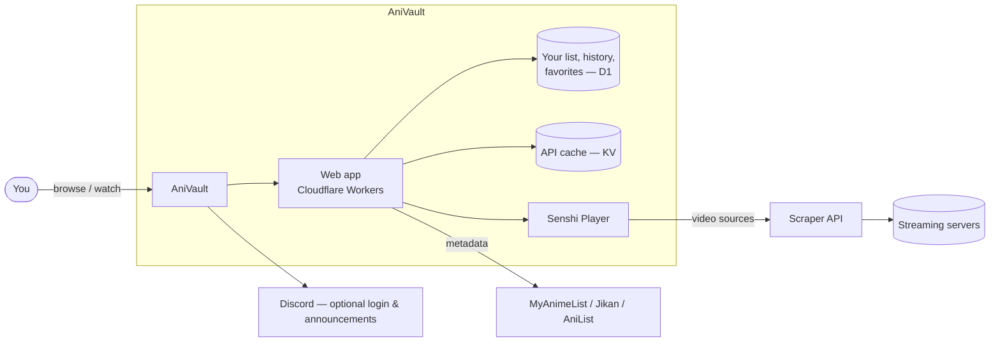

# AniVault

**Track your anime, discover new series, and connect with the community.**

Free & ad-free anime streaming — no fluff, no paywalls, no popups.

[**anivault.co**](https://www.anivault.co) · Sub & Dub · Free Forever

---

## What is AniVault?

AniVault is a free anime streaming and tracking platform. Watch anime subbed
or dubbed with zero ads, keep a personal list of what you're watching, and
never lose your place again — every episode picks back up exactly where you
left off.

It's built and run as a solo, self-hosted project: no investors, no ad
networks, no premium tier. Just a fast site for watching and tracking anime.

## Features

### 🎬 Watch
- **Sub & dub** playback across multiple streaming servers, with automatic
  fallback if one goes down
- **Senshi Player** — a custom-built video player with double-tap seek,
  always-visible volume control, subtitle rendering, and prev/next episode
  navigation baked in
- Ad-overlay blocking on every server, so nothing interrupts an episode

### 📋 Track
- Personal anime list with **Watching / Completed / Plan to Watch / Dropped**
  statuses
- Auto-updates your list as you watch — marks a series "Watching" a few
  minutes in, and checks off episodes near the end, no manual bookkeeping
- **Watch history** and **Continue Watching** row on the homepage, always
  picking up mid-episode
- **Favorites** for the series you don't want to lose track of
- **Import / Export** your list to move data in or out freely

### 🔎 Discover
- **Browse** with genre, status, and season filters
- **Seasonal** chart for what's airing right now
- **Top Anime** rankings
- **Schedule** with live countdowns to the next episode (JST-accurate)
- Live search-as-you-type suggestions

### 👤 Community & Accounts
- Sign up with email or **Google / Discord** login
- Public profile pages, badges, and notifications
- Optional Discord server integration for announcements

### 🛡️ Admin
- Full internal dashboard for analytics, user management, content curation,
  and moderation — kept behind the scenes so the site stays lightweight for
  everyone else

## How it works

Anime info, ratings, and episode data are pulled live from MyAnimeList,
Jikan, and AniList — AniVault doesn't host or claim ownership of any anime
content itself. Your account data (lists, history, favorites) lives in your
own AniVault account and nowhere else.

## Tech stack

| Layer | Tech |
|---|---|
| Site | Cloudflare Workers (TypeScript), [Hono](https://hono.dev) |
| Database | Cloudflare D1 |
| Caching | Cloudflare KV |
| Media storage | Cloudflare R2 |
| Video sourcing | Custom Node.js/TypeScript scraper API |
| Player | Senshi Player (custom-built HTML5 player) |
| Auth | Email/password, Google OAuth, Discord OAuth |

## Status

AniVault is under active, ongoing development — new streaming servers,
player fixes, and features ship regularly. Found a bug or have a request?
Reach out through the site's feedback tool or the Discord.

---

Made with ❤️ for anime fans, by an anime fan.

